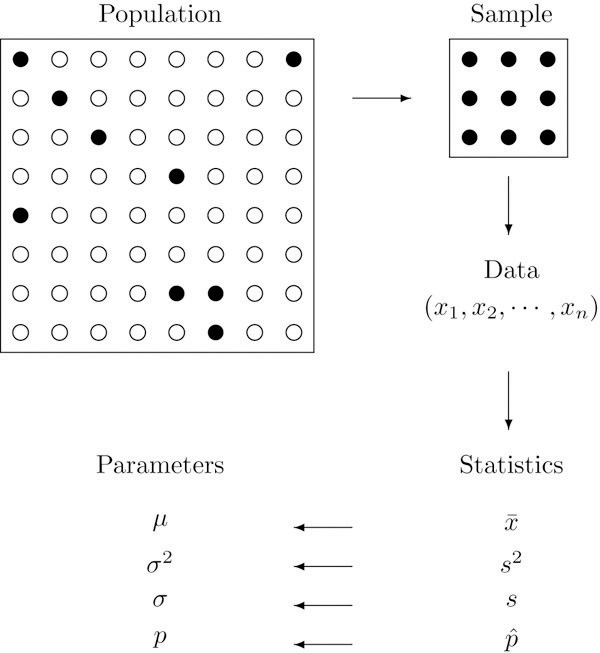

Before jumping into network science details, we need to cover some fundamentals. I assume that most of the contents here are well known to you--we will be brief--but I want to ensure we are all on the same page.

## Why networks

Networks are a fundamental part—the cornerstone—of complexity science. Most, if not all, questions in complex systems models involve some type of network. As we would expect, dealing with networks can be, well, complex. Unlike other data types, networks are inherently endogenous: the relationships between entities are not independent observations but rather interconnected in ways that influence one another. From the statistical perspective, this means that regular inference methods do not apply in this context. This is precisely why we have an entire field dedicated to understanding and analyzing networks.

Depending on your background (and, to a lesser extent, the question you are trying to answer), there are two main approaches to studying networks. The first is **Network Science**, which largely emerges from the natural sciences. Researchers in this tradition are typically interested in identifying laws or other general patterns governing network structure and dynamics; much of the work focuses on network prediction. The second approach is **Social Network Analysis (SNA)**, which, as the name suggests, comes from the social sciences. While SNA researchers are also interested in general patterns, contextual information and the particular application are highly relevant. Much of the work centers on network-based inference, and although the network itself is key, it often goes hand-in-hand with understanding behavior.

Here is a non-comprehensive list of types of more especific topics that statistical network analysis can help address or is involved at some level:

- Social Influence 1: How peers' behavior affects individuals'.
- Formation 1 (selection): What factors and processes yield observed networks. 
- Co-evolution of networks and behavior: The joint problem of selection and influence.
- Contagion processes 1: Especifically, communicable diseases transmission between humans.
- Contagion processes 2: In healthcare settings, how contact networks in multimodal networks influence the transmission process (*e.g.*, hospital acquired infections, HAIs).
- Comparative Phylogenetics: How especific traits are related across species thorugh the evolutionary process.
- Graph Neural Networks: How network data is incorporated in Neural Network Architectures (including graph embeddings).
- Formation 2: In biological settings, ERGMs (which we review here) have been used to study gene-regulatory networks and (biological) neural networks, among others.
- Cognitive Social Structures: Individuals' perceptions of networks.
- etc.

::: {.callout-tip}
A good way to learn about this is looking into the sessions of the International Network for Social Network Analysis (INSNA) Sunbelt Conference: <https://sunbelt2025.org/>.
:::

In this course, we will be looking into network inference in general. Although most of the methodologies described here come from SNA, they are easy to port to other fields and types of questions. To illustrate the breadth of network science, consider a few example questions we can try to address: What would be the best strategy to launch a public health campaign in a school? How do two species compare in a given phenotype, and can we do inference directly from their interaction networks? What marks the success of a weight loss program, and how big of a role do social networks play in it?

## Network data

The networks we will be studying here can be formally described as a tuple $G \equiv \{V, E\}$, where $V = \{v_1, v_2, \ldots, v_n\}$ is the set of $n$ vertices (also called actors or nodes) and $E \subseteq V \times V$ is the set of edges (also called ties or links). Each edge $e_{ij} \in E$ represents a connection between nodes $i$ and $j$. Edges can be either binary (present or absent) or weighted, where the weight captures the strength or intensity of the relationship. When the network is directed, we distinguish between the source (or ego)—the node that originates the tie—and the target (or alter)—the node that receives it.

Networks can vary in their structure and complexity. A **unimodal** (or one-mode) network is one where all nodes are of the same type, such as a friendship network among students. In contrast, **multimodal** networks (most commonly bimodal or bipartite) contain nodes of different types; for example, a network connecting authors to papers. Networks can also represent multiple types of ties simultaneously, forming what we call **multiplex networks**. In an organization, for instance, friendship, mentorship, and communication networks coexist among the same set of individuals. Adding further complexity, edges can extend beyond pairs to connect arbitrary sets of nodes, giving rise to **hypergraphs** or hyper-networks.

### Representing network data

Network data can be stored and manipulated in various ways. One of the most common representations is an **edge list**, a simple two-column format where each row describes a tie:

| ego | alter |
|-----|-------|
| 0   | 1     |
| 0   | 2     |
| 4   | 1     |

The same network can be represented as an **adjacency matrix** $\mathbf{A}$, an $n \times n$ matrix where entry $A_{ij}$ indicates the presence (or weight) of an edge from node $i$ to node $j$. For an undirected, unweighted network, $A_{ij} = 1$ if nodes $i$ and $j$ are connected and $A_{ij} = 0$ otherwise. The adjacency matrix is symmetric for undirected networks ($A_{ij} = A_{ji}$). For the edge list above (assuming 5 nodes labeled 0–4), the adjacency matrix would be:

$$
\mathbf{A} = \begin{pmatrix}
0 & 1 & 1 & 0 & 0 \\
1 & 0 & 0 & 0 & 1 \\
1 & 0 & 0 & 0 & 0 \\
0 & 0 & 0 & 0 & 0 \\
0 & 1 & 0 & 0 & 0
\end{pmatrix}
$$

Although adjacency matrices use more memory than edge lists—$O(n^2)$ versus $O(|E|)$—they are convenient from a mathematical perspective and allow us to leverage linear algebra for network computations.


## Statistics

Generally, statistics are used for two purposes: to describe and to infer. We observe data samples in descriptive statistics, recording and reporting the mean, median, and standard deviation, among other statistics. Statistical inference, on the other hand, is used to infer the properties of a population from a sample, particularly, about population parameters.

{width=70%}

From the perspective of network science, descriptive statistics are used to describe the properties of a network, such as the number of nodes and edges, the degree distribution, the clustering coefficient, etc. Statistical inference in network science has to do with addressing questions about the underlying properties of networked systems; some questions include the following:

- Are two networks different?
- Is the number of observed triangles in a network higher than expected by chance?
- Are individuals in a network more likely to be connected to individuals with similar characteristics?
- etc.

Part of statistical inference is hypothesis testing.

## Hypothesis testing

According to Wikipedia

> A statistical hypothesis test is a method of statistical inference used to decide whether the data at hand sufficiently support a particular hypothesis. More generally, hypothesis testing allows us to make probabilistic statements about population parameters. More informally, hypothesis testing is the processes of making decisions under uncertainty. Typically, hypothesis testing procedures involve a user selected tradeoff between false positives and false negatives. -- [Wiki](https://en.wikipedia.org/w/index.php?title=Statistical_hypothesis_testing&oldid=1193806218)

In a nutshell, hypothesis testing is performed by following these steps:

1. State the null and alternative hypotheses. In general, the null hypothesis is a statement about the population parameter that challenges our research question; for example, given the question of whether two networks are different, the null hypothesis would be that the two networks are the same. 

2. Compute the corresponding test statistic. It is a data function that reduces the information to a single number.

3. Compare the observed test statistic with the distribution of the test statistic under the null hypothesis. The sometimes infamous p-value: ``[...] the probability that the chosen test statistic would have been at least as large as its observed value *if* every **model assumption were correct**, including the test hypothesis.'' [@greenlandStatisticalTestsValues2016] [^pvaluegelman]

[^pvaluegelman]: The discussion about interpreting p-values and hypothesis testing is vast and relevant. Although we will not review this here, I recommend looking into the work of Andrew Gelman @gelmanFailureNullHypothesis2018.

4. Report the observed effect and p-value, *i.e.*, $\Pr{t \in H_0}$

We usually say that we either *reject the null hypothesis* or *fail to reject it* (we never accept the null hypothesis), but in my view, it is always better to talk about it in terms of "suggests evidence for" or "suggests evidence against."

We will illustrate statistical concepts more concretely in the next section.

## Statistical programming

Statistical programming (or computing) is the science of leveraging modern computing power to solve statistical problems. The R programming language is the de facto language for statistical programming, and so it has an extensive collection of packages implementing statistical methods and functions. 

## Probability distributions

R has a standard way of naming probability functions. The naming structure is `[type of function][distribution]`, where `[type of function]` can be `d` for density, `p` for cumulative distribution function, `q` for quantile function, and `r` for random generation. For example, the normal distribution has the following functions:

```{r}
#| label: probability-distributions
#| collapse: true
dnorm(0, mean = 0, sd = 1)
pnorm(0, mean = 0, sd = 1)
qnorm(0.5, mean = 0, sd = 1)
```

Now, if we wanted to know what is the probability of observing a value smaller than -2 coming from a standard normal distribution, we would do:

```{r}
#| label: probability-distributions-pnorm
#| collapse: true
pnorm(-2, mean = 0, sd = 1)
```

Currently, R has a wide range of probability distributions implemented. 

::: {.callout title="Question"}
How many probability distributions are implemented in R's stats package?
:::

## Random number generation

Random numbers, and more precisely, pseudo-random numbers, are a vital component of statistical programming. Pure randomness is hard to come by, and so we rely on pseudo-random number generators (PRNGs) to generate random numbers (although quantum computing is changing the paradigm). These generators are deterministic algorithms that produce sequences of numbers we can then use to generate random samples from probability distributions. Because of the latter, PRNGs need a starting point called the seed. As a statistical computing program, R has a variety of PRNGs. As suggested in the previous subsection, we can generate random numbers from a probability distribution with the `r` function. In what follows, we will draw random numbers from a few distributions and plot histograms of the results:

```{r}
#| label: random-number-generation
#| collapse: true
set.seed(1)

## Saving the current graphical parameters
op <- par(mfrow = c(2,2))
rnorm(1000) |> hist(main = "Normal distribution")
runif(1000) |> hist(main = "Uniform distribution")
rpois(1000, lambda = 1) |> hist(main = "Poisson distribution")
rbinom(1000, size = 10, prob = 0.1) |> hist(main = "Binomial distribution")
par(op)
```

## Simulations and sampling

Simulations are front and center in statistical programming. We can use them to test the properties of statistical methods, generate data, and perform statistical inference. The following example uses the sample function in R to compute the bootstrap standard error of the mean [see @casellaStatisticalInference2021]:

```{r}
#| label: simulations
#| collapse: true
set.seed(1)
x <- rnorm(1000)

## Bootstrap standard error of the mean
n <- length(x)
B <- 1000

## We will store the results in a vector
res <- numeric(B)

for (i in 1:B) {
  # Sample with replacement
  res[i] <- sample(x, size = n, replace = TRUE) |>
    mean()
}

## Plot the results
hist(res, main = "Bootstrap standard error of the mean")
```

Since the previous example is rather extensive, let us review it in detail. 

- `set.seed(1)` sets the seed of the PRNG to 1. It ensures we get the same results every time we run the code.

- `rnorm()` generates a sample of 1,000 standard-normal values. 

- `n <- length(x)` stores the length of the vector in the `n` variable.

- `B <- 1000` stores the number of bootstrap samples in the `B` variable.

- `res <- numeric(B)` creates a vector of length `B` to store the results.

- `for (i in 1:B)` is a for loop that iterates from 1 to `B`.

- `res[i] <- sample(x, size = n, replace = TRUE) |> mean()` samples `n` values from `x` with replacement and computes the mean of the sample.

- The pipe operator (`|>`) passes the output of the left-hand side expression as the first argument of the right-hand side expression.

- `hist(res, main = "Bootstrap standard error of the mean")` plots the histogram of the results.


