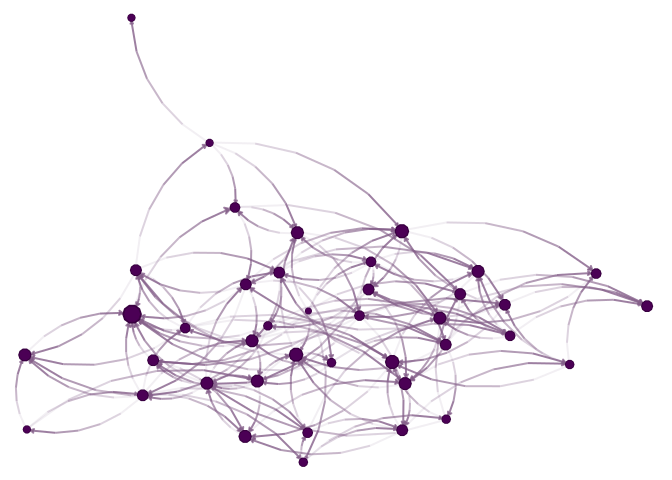
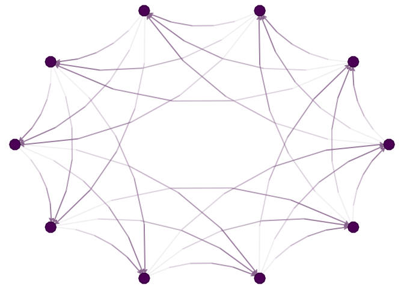
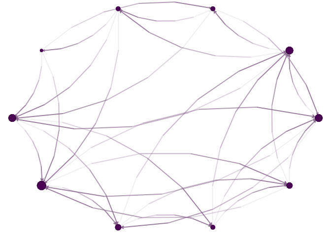
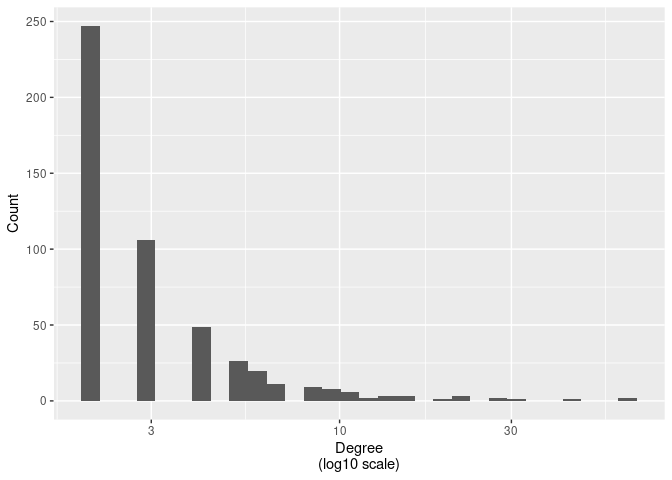

# Random graphs

# Introduction

In this section, we will focus on reviewing the most common random graph
models, how these are used, and what things are important to consider
when using them. Later on in the course, we will focus on
Exponential-Family Random Graph Models (ERGMs), which are a
generalization of the models we will discuss here.

# Erdős–Rényi model

The Erdős–Rényi model is the simplest random graph model. It is defined
by two parameters: $n$ and $p$. The parameter $n$ is the number of nodes
in the graph, and $p$ is the probability that any two nodes are
connected by an edge. The model is named after Paul Erdős and Alfréd
Rényi, who first introduced it in 1959.

Formally, we can describe the ER model as follows: $(V, E)$ where
$V = \{1, \ldots, n\}$ and $E$ is a set of edges, where each edge is
included with probability $p$.

<div>

> **Tip**
>
> **Computing note**: In the case of large networks, sampling ER graphs
> can be done effectively in a two-step process. First, we sample the
> number of edges in the graph from a binomial distribution. Then, we
> sample the edges uniformly at random from the set of all possible
> edges. This is much more efficient than sampling each edge
> independently since the number of possible edges is much smaller than
> the number of possible graphs.

</div>

Most of the time, the ER is used as a reference distribution for
studying real-world networks. Nevertheless, using the ER model as a null
model for a real-world network is not always a good idea, as it may
inflate the type two error rate.

## Code example

``` r
# Model parameters
n <- 40
p <- 0.1

# Generating the graph, version 1
set.seed(3312)
g <- matrix(as.integer(runif(n * n) < p), nrow = n, ncol = n)
diag(g) <- 0

# Visualizing the network
library(igraph)
library(netplot)
nplot(graph_from_adjacency_matrix(g))
```



**Challenge 1**: How would you generate the graph using the two-step
process described above?

**Challenge 2**: Using a Generalized-Linear-Model \[GLM\], estimate $p$
and its variance from the above network.

# Watts-Strogatz model

The second model in our list is the small-world model, introduced by
Duncan Watts and Steven Strogatz in 1998. The model is defined by three
parameters: $n$, $k$, and $p$. The parameter $n$ is the number of nodes
in the graph, $k$ is the number of neighbors each node is connected to,
and $p$ is the probability that an edge is rewired. As its name
suggests, the networks sampled from this model hold the small-world
property, which means that the average distance between any two nodes is
small.

Networks from the WS model are generated as follows:

1.  Start with a ring of $n$ nodes, where each node is connected to its
    $k$ nearest neighbors.

2.  For each edge $(u, v)$, rewire it with probability $p$ by replacing
    it with a random edge $(u, w)$, where $w$ is chosen uniformly at
    random from the set of all nodes.

**Challenge:** How would you generate a WS graph using the two-step
process described above?

## Code example

``` r
# Creating a ring
n <- 10
V <- 1:n
k <- 3
p <- .2

E <- NULL
for (i in 1:k) {
  E <- rbind(E, cbind(V, c(V[-c(1:i)], V[1:i])))
}

# Generating the ring layout
lo <- layout_in_circle(graph_from_edgelist(E))

# Plotting with netplot
nplot(
  graph_from_edgelist(E),
  layout = lo
  )
```



``` r
# Rewiring
ids <- which(runif(nrow(E)) < p)
E[ids, 2] <- sample(V, length(ids), replace = TRUE)
nplot(
  graph_from_edgelist(E),
  layout = lo
  )
```



# Scale-free networks

Scale-free networks are networks where the degree distribution follows a
power-law distribution. The power-law distribution is a heavy-tailed
distribution, which means that it has a long tail of high-degree nodes.
The power-law distribution is defined as follows:

$$
p(k) = C k^{-\gamma}
$$

where $C$ is a normalization constant and $\gamma$ is the power-law
exponent. The power-law exponent is usually between 2 and 3, but it can
be any value larger than 2. The power-law distribution is a special case
of the more general class of distributions called the Pareto
distribution.

Scale-free networks are generated using the Barabási–Albert model, which
was introduced by Albert-László Barabási and Réka Albert in 1999. The
model is defined by two parameters: $n$ and $m$. The parameter $n$ is
the number of nodes in the graph, and $m$ is the number of edges added
at each time step. The model is generated as follows:

1.  Start with a graph of $m$ nodes, where each node is connected to all
    other nodes.

2.  At each time step, add a new node to the graph and connect it to $m$
    existing nodes. The probability that a new node is connected to an
    existing node $i$ is proportional to the degree of $i$.

## Code example

``` r
# Model parameters
n <- 500
m <- 2

# Generating the graph
set.seed(3312)
g <- matrix(0, nrow = n, ncol = n)
g[1:m, 1:m] <- 1
diag(g) <- 0

# Adding nodes
for (i in (m + 1):n) {

  # Selecting the nodes to connect to
  ids <- sample(
    x       = 1:(i-1), # Up to i-1
    size    = m,       # m nodes
    replace = FALSE,   # No replacement
    # Probability proportional to the degree
    prob    = colSums(g[, 1:(i-1), drop = FALSE])
    )

  # Adding the edges
  g[i, ids] <- 1
  g[ids, i] <- 1

}

# Visualizing the degree distribution
library(ggplot2)
data.frame(degree = colSums(g)) |>
  ggplot(aes(degree)) +
  geom_histogram() +
  scale_x_log10() +
  labs(
    x = "Degree\n(log10 scale)",
    y = "Count"
  )
```



# References
